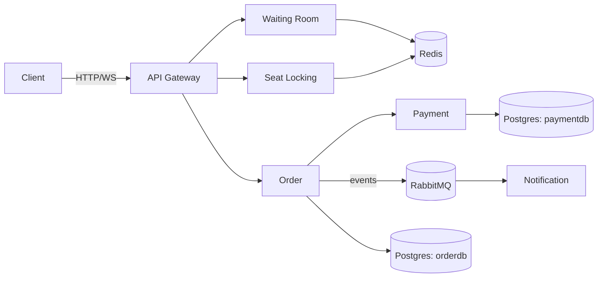

# Concert Ticket

A backend-focused learning project. The goal isn't to build a ticket-selling website — it's to solve the interesting problem underneath one: when thousands of people try to buy tickets at the same moment, how do you make sure the same seat never gets sold to two people?

This was inspired by Ticketmaster's 2022 Taylor Swift on-sale, which crashed for exactly this reason.

## How it works

The project is made of 6 small services, each responsible for its own piece:

- **api-gateway** — routes incoming requests to the right service
- **waiting-room** — puts users in a virtual queue during high traffic, lets them in a few at a time
- **seat-locking** — where seat selection/locking happens, the most critical part of the project (uses Redis)
- **order** — manages the purchase flow: charge payment, confirm the seat, roll back if anything fails
- **payment** — a fake payment service (no real money, just for testing)
- **notification** — sends a notification once an order is complete (currently just logs it)

See [ARCHITECTURE.md](./ARCHITECTURE.md) for how the services talk to each other and the full flow.



## Tech stack

Go · Redis · RabbitMQ · PostgreSQL · WebSocket · Docker Compose

## Getting started

```bash
git clone https://github.com/EkimBolat/concert-ticket.git
cd concert-ticket
docker-compose up --build
```

Once running, each service exposes a `/health` endpoint:

| Service | Port |
|---------|------|
| api-gateway | 8080 |
| waiting-room | 8081 |
| seat-locking | 8082 |
| order | 8083 |
| payment | 8084 |
| notification | 8085 |
| RabbitMQ management UI | 15672 (guest/guest) |

## Status

Still a work in progress. Done so far:

- [x] seat-locking — locking with Redis `SETNX` + TTL, live seat status over WebSocket
- [ ] waiting-room — queueing system, admission tokens
- [ ] order — saga flow (release the seat if payment fails)
- [ ] payment — fake payment service
- [ ] notification — notification service
- [ ] api-gateway — routing + rate limiting
- [ ] tests
