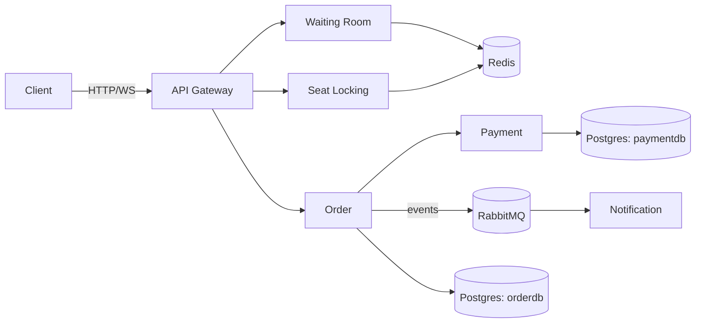

# 🎫 Concert Ticket

[](https://github.com/EkimBolat/concert-ticket/actions/workflows/ci.yml)

A backend-focused learning project. The goal isn't to build a ticket-selling website — it's to solve the interesting problem underneath one: when thousands of people try to buy tickets at the same moment, how do you make sure the same seat never gets sold to two people?

This was inspired by Ticketmaster's 2022 Taylor Swift on-sale, which crashed for exactly this reason.

## 🧩 How it works

The project is made of 6 small services, each responsible for its own piece:

- **api-gateway** — routes incoming requests to the right service
- **waiting-room** — puts users in a virtual queue during high traffic, lets them in a few at a time
- **seat-locking** — where seat selection/locking happens, the most critical part of the project (uses Redis)
- **order** — manages the purchase flow: charge payment, confirm the seat, roll back if anything fails
- **payment** — a fake payment service (no real money, just for testing)
- **notification** — sends a notification once an order is complete (currently just logs it)

See [ARCHITECTURE.md](./ARCHITECTURE.md) for how the services talk to each other and the full flow.



## 🛠️ Tech stack

Go · Redis · RabbitMQ · PostgreSQL · WebSocket · Docker Compose

## 🚀 Getting started

```bash
git clone https://github.com/EkimBolat/concert-ticket.git
cd concert-ticket
docker-compose up --build
```

Once running, each service exposes a `/health` endpoint:

| Service | Port |
|---------|------|
| api-gateway | 8080 |
| waiting-room | 8081 |
| seat-locking | 8082 |
| order | 8083 |
| payment | 8084 |
| notification | 8085 |
| RabbitMQ management UI | 15672 (guest/guest) |

## 🧪 Testing

`seat-locking` and `order` have integration tests behind a build tag (they need a real Redis / Postgres to run against):

```bash
cd services/seat-locking
go test -tags=integration ./... -v

cd services/order
go test -tags=integration ./... -v
```

The one worth reading is `TestLockSeat_ConcurrentCallers_OnlyOneWins` in `services/seat-locking/lock_test.go` — it fires 50 concurrent goroutines at the same seat and asserts exactly one of them wins the lock. That's the core guarantee of the whole project, proven with a test instead of just a claim.

## 📌 Status

The core system is done — all 6 services work end to end, including the full purchase saga with compensating actions on failure.

- [x] seat-locking — locking with Redis `SETNX` + TTL, live seat status over WebSocket
- [x] waiting-room — queueing system, admission tokens
- [x] order — saga flow (charge → confirm seat, release/refund on failure)
- [x] payment — fake payment service, idempotent by orderId
- [x] notification — consumes order events from RabbitMQ, logs mock notifications
- [x] api-gateway — reverse proxy to all services, per-IP rate limiting
- [x] tests — concurrency test on the seat lock, saga tests on the order flow
- [x] CI (GitHub Actions): builds all 6 services + runs integration tests on every push
